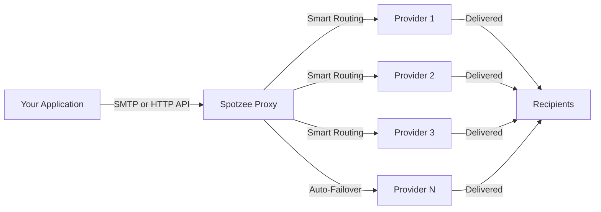

# Spotzee Email Proxy - MailWizz Extension

Smart email delivery that routes through multiple providers automatically. **100% deliverability** through reliable queueing. Pay only $0.00007 per email ($0.07 per 1,000 emails) with no monthly fees.

## Quick Start Guide

### 1. Create Your Spotzee Account (Free)
Sign up for a [Spotzee](https://app.spotzee.com/sign-up) account

### 2. Add Funds
- Go to [Organization Billing](https://app.spotzee.com/organization/billing)
- Top up your account and/or configure auto top-up

### 3. Configure Email Providers
- Open your project (or create a new one)
- Go to **Settings → Email Proxy** tab
- Click **Import Providers** to add your SMTP accounts
- Configure each provider:
  - Quotas (per second, minute, hour, day)
  - Tracking domain
  - From email, From name
  - Reply-to email, Reply-to name
  - Traffic percentage (100 = highest priority)

### 4. Generate API Credentials for MailWizz
- Click the **Setup** button
- Generate a new API key
- The Setup modal displays your **Username** and **API Key**
- Copy these credentials - you'll use them in MailWizz:
  - Username → MailWizz username field
  - API Key → MailWizz password field

### 5. Configure Webhooks
- Go to **Event Webhooks** tab
- Click **Add New Webhook**
- Select **"Bounces"** events
- Enter the webhook URL from your MailWizz delivery server settings (shown in the info modal)

### 6. Add to MailWizz
- In MailWizz, go to **Delivery Servers → Create New**
- Select **Spotzee Email Proxy API**
- Enter your username and password from step 4
- Save

### 7. Start Sending
Send campaigns through MailWizz as normal. View delivery logs in Spotzee by clicking **Email Proxy → View Logs**.

---

## MailWizz Integration

This extension seamlessly integrates MailWizz with Spotzee Email Proxy API:

- **Simple Setup** - Add your Spotzee credentials as a delivery server in MailWizz
- **Automatic Bounce Handling** - Hard/soft bounces are logged and subscribers are blacklisted automatically
- **Complaint Processing** - Abuse reports unsubscribe recipients and protect your sender reputation
- **Real-Time Webhooks** - Delivery events update campaign statistics instantly
- **No Manual Configuration** - Webhook URLs are generated automatically

Send campaigns through MailWizz as usual - all bounce and complaint handling happens automatically.

## How It Works

**One Endpoint, Multiple Providers**
- Send via SMTP server (port 587) or HTTP API endpoint
- Your emails route automatically across all configured providers
- Failed providers bypassed instantly with zero downtime

**Human-Like Sending**
- Configure rate limit ranges (e.g., "2-3 per hour", "20-25 per day")
- System randomizes sending rate every 5 minutes within your range
- Appears natural to email providers, improves deliverability

## Key Benefits

### 💰 Pay Only for What You Send
- **$0.00007 per email** ($0.07 per 1,000 emails)
- No monthly fees, no minimums, no hidden costs

### 🚀 100% Deliverability
- Reliable message queueing ensures every email is delivered
- Automatic failover when providers fail
- Multi-provider redundancy with smart routing

### ⚡ Built for Scale
- **10+ million emails per day** capacity
- **1,000+ emails per second** at peak load
- Automatic scaling as your volume grows

### 🔧 Dual Integration Options
- **SMTP Server** - Standard port 587, works with any email client
- **HTTP REST API** - For programmatic sending
- Same authentication for both methods

### 🤖 Human-Like Sending Patterns
- Configure rate limit ranges (e.g., "5-10 per hour")
- System randomizes within range every 5 minutes
- Mimics natural sending behavior for better inbox placement

### 🎯 Flexible Routing
- Percentage-based distribution across providers
- Group-based routing for specific campaigns
- Per-second, per-minute, per-hour, and per-day quotas
- Custom domain policies

### 🛡️ Enterprise-Grade Security
- Encrypted provider credentials
- TLS/SSL email transmission
- DDoS protection with rate limiting
- Complete audit logging

### 📊 Complete Visibility
- Real-time delivery tracking
- Provider performance metrics
- Transparent billing to the cent
- Detailed delivery logs

## Who It's For

**SaaS Applications** - Transactional emails (password resets, notifications) delivered reliably.

**Marketing Teams** - Campaign emails distributed across providers automatically.

**E-commerce Platforms** - Order confirmations and shipping notifications with 100% deliverability.

**Developers** - Drop-in SMTP replacement or REST API integration.

## Getting Started

### Quick Setup

1. **Add Providers** - Configure your SMTP accounts with rate limits
2. **Get Credentials** - Receive your API key
3. **Start Sending** - Use SMTP (port 587) or HTTP API

### Pricing Example

**100,000 emails per month:**
- Cost: 100,000 × $0.00007 = **$7.00/month** ($0.07 per 1,000 emails)
- No base fees, no per-provider charges
- Pay only for successful deliveries

**1 million emails per month:**
- Cost: 1,000,000 × $0.00007 = **$70.00/month** ($0.07 per 1,000 emails)

## Why Choose Spotzee Email Proxy?

✅ **100% Deliverability** - Reliable queueing ensures delivery  
✅ **SMTP or HTTP** - Use whichever fits your workflow  
✅ **Human-Like Sending** - Randomized rates look natural  
✅ **Transparent Pricing** - $0.07 per 1,000 emails, nothing else  
✅ **Zero Downtime** - Automatic failover keeps emails flowing  
✅ **Battle-Tested** - Proven at millions of emails daily  

---

**Ready to improve your email deliverability?**

[Get Started](https://spotzee.com) | [View Documentation](https://help.spotzee.com) | [Contact Support](mailto:contact@spotzee.com)